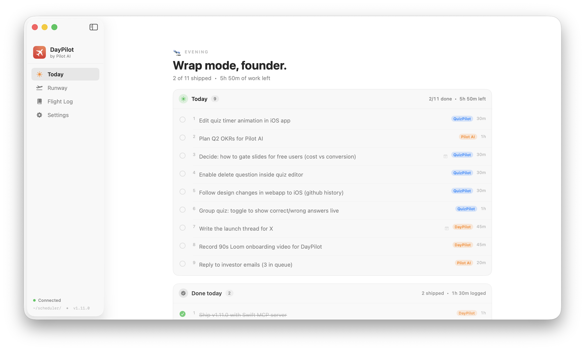
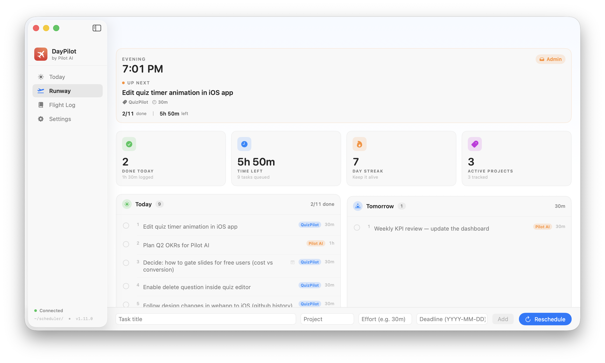
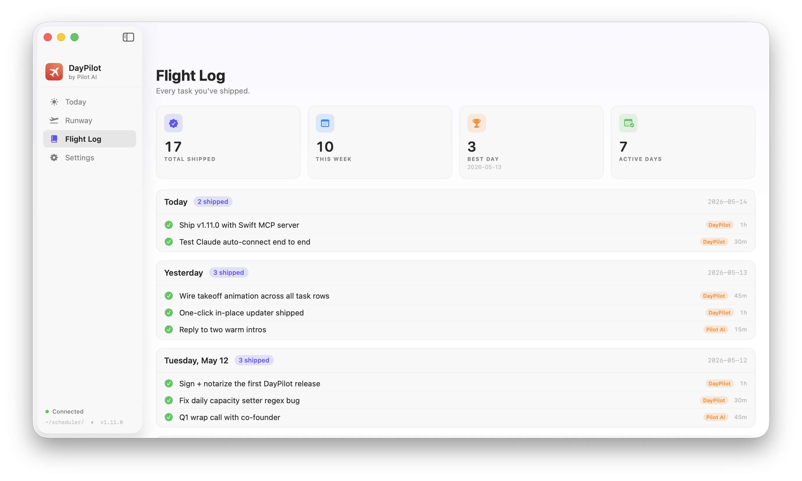

# DayPilot

> Founder's cockpit for the day. A native macOS scheduler with a bundled MCP server that **auto-connects to Claude** on install. No Node, no config, no cloud. Plans your day from two markdown files.

   



---

## What it is

DayPilot reads two files from `~/scheduler/`:

- **`todos.md`** — your task list
- **`memory.md`** — your projects, priorities, and daily capacity

It sorts by deadline → priority → effort, fills your day up to `daily_capacity`, and gives you four views:

- **Today** — a focused, distraction-free list of just today
- **Runway** — full cockpit with Now card, stats (done today, time left, streak, projects), and Today + Tomorrow side by side
- **Flight Log** — every task you've shipped, by day
- **Menubar popover** — quick view + chip-based add task, always one click away

Edit the files in any editor — the app watches and updates live.



---

## MCP — auto-connects to Claude

DayPilot ships a **native Swift MCP server** (no Node, no npm, no `node_modules`) and on first launch silently registers itself with both:

- **Claude Code** (`~/.claude.json`)
- **Claude Desktop** (`~/Library/Application Support/Claude/claude_desktop_config.json`)

Restart Claude and you get 11 tools instantly:

```
add_task          remove_task        update_task_notes
complete_task     read_memory        update_memory
uncomplete_task   set_capacity       set_project
list_tasks        read_done_log
```

Now you can say things like *"Claude, what's on my plate today?"* or *"add a 30m task to ship the changelog under QuizPilot"* and it just works. Idempotent — if you move the .app, next launch repoints the config automatically.



---

## Install

Grab the latest signed `.zip` from [Releases](https://github.com/tommyvahabov/DayPilot/releases/latest), unzip, drag `DayPilot.app` to `/Applications`, and open it.

**Apple Silicon only.** Signed with Developer ID + Hardened Runtime + notarized by Apple — no Gatekeeper warnings.

### Build from source

```bash
git clone https://github.com/tommyvahabov/DayPilot.git
cd DayPilot
swift build -c release
./bundle.sh
open ~/Applications/DayPilot.app
```

---

## File format

### `todos.md`

```markdown
- [ ] Ship landing page | project: QuizPilot | effort: 2h | deadline: 2026-05-30
- [ ] Review PR | project: QuizPilot | effort: 30m
  note: focus on the auth flow changes
- [x] Already done
```

| Field | Format | Default |
|-------|--------|---------|
| `project` | `project: Name` | none |
| `effort` | `30m` / `1h` / `1h30m` | 15m |
| `deadline` | `YYYY-MM-DD` | none (sorts last) |
| notes | indented lines below the task | — |

### `memory.md`

```markdown
## Projects
- QuizPilot | priority: 1 | deadline: 2026-05-30
- DayPilot | priority: 2

## Settings
daily_capacity: 6h
```

---

## Scheduling logic

1. Filter uncompleted tasks
2. Sort by **deadline proximity → project priority (1 = highest) → effort (shortest first)**
3. Fill **Today** until `daily_capacity` is reached
4. Fill **Tomorrow** with the next `daily_capacity` worth
5. Rest → **Backlog**

---

## Features

- **Native macOS app** — SwiftUI, no Electron, no web view
- **Dock + Menubar** — full window for planning, menubar for quick capture
- **Today greeting** — time-aware ("Good morning, founder" / "Still grinding, founder?" at 2am) that cube-rotates into the date header
- **Chip-based quick add** — pick project, effort, deadline from tappable chips. New projects auto-save to `memory.md`
- **Takeoff animation** — check off a task and an airplane chases the title off-screen
- **One-click auto-update** — sidebar shows "Update to X" when a new release is out; click to swap and relaunch
- **Drag to reorder** in any task list
- **Notes per task** — expandable, persisted as indented lines in `todos.md`
- **Day streak + Flight Log** — track shipping consistency across weeks
- **Bundled Claude MCP server** — auto-registers on install
- **Auto-bootstrap** — creates `~/scheduler/` with seed files on first launch
- **Signed + notarized** — no Gatekeeper friction, safe to share with friends

---

## Requirements

- macOS 14 (Sonoma) or newer
- Apple Silicon (M1/M2/M3/M4)

---

## License

MIT
